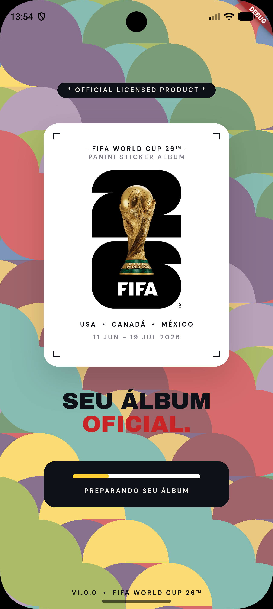
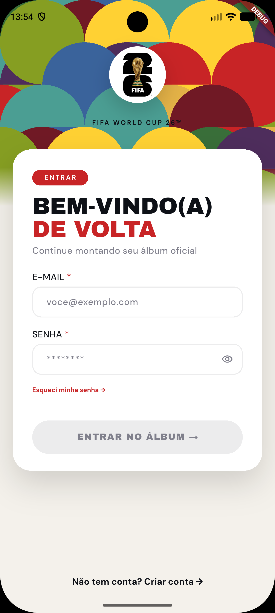
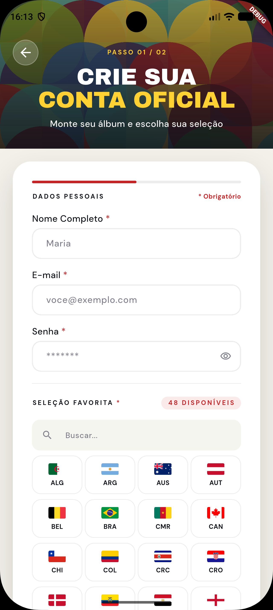
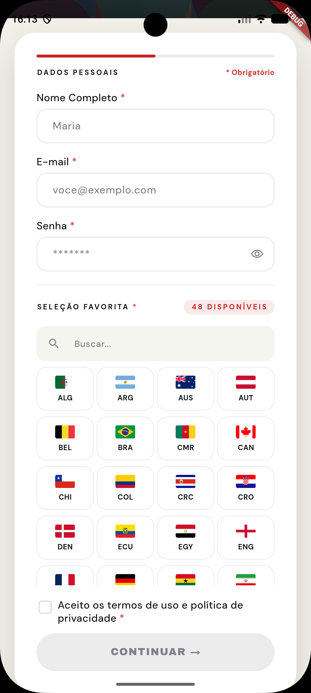
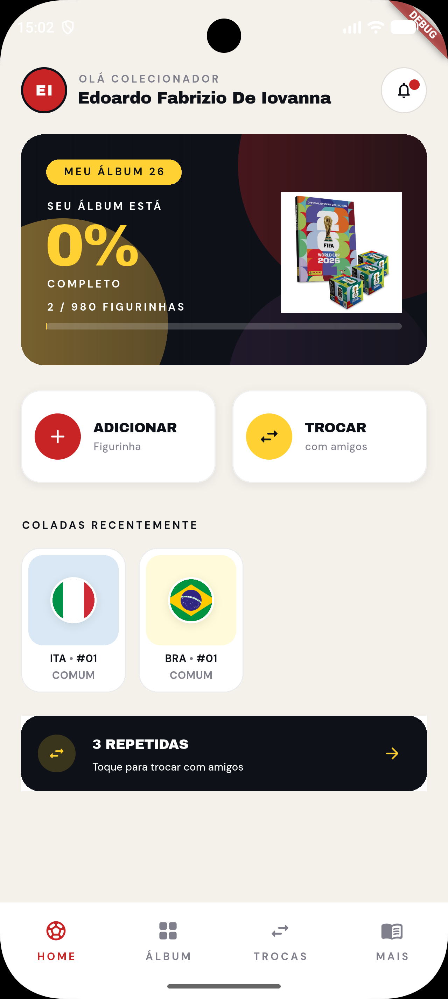
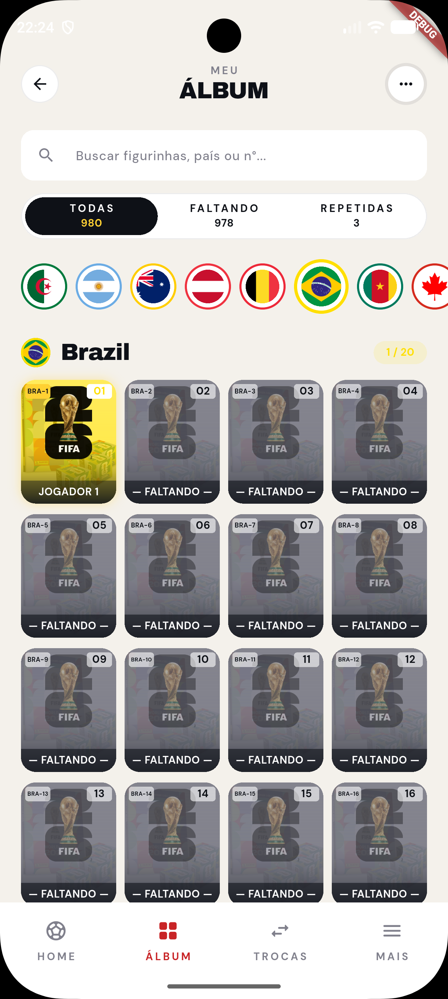
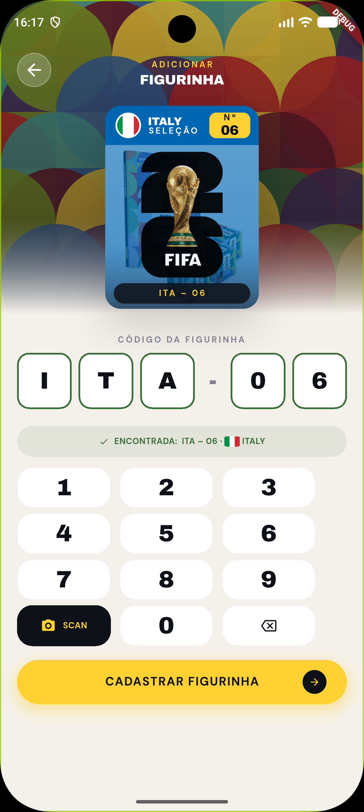
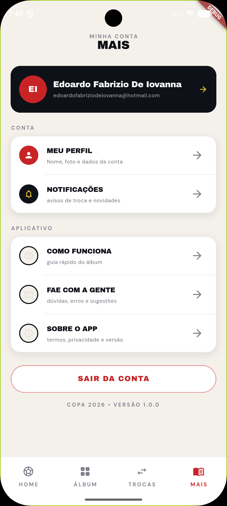

# FIFA World Cup 2026 Panini Sticker Album App ⚽

## Description

This project is a Flutter application simulating a Panini FIFA World Cup 2026 sticker album. It was developed as part of a course from [R5 Academy](https://instituto.r5academy.com.br/), taught by Professor [Rodrigo Rahman](https://github.com/rodrigorahman). The app allows users to manage their sticker collection for the upcoming World Cup.

## Screenshots

<table>
  <tr>
    <td align="center">
      
      <br>
      <sub><b>Splash Screen</b></sub>
    </td>
    <td align="center">
      
      <br>
      <sub><b>Welcome Screen</b></sub>
    </td>
    <td align="center">
      
      <br>
      <sub><b>Login</b></sub>
    </td>
  </tr>

  <tr>
    <td align="center">
      
      <br>
      <sub><b>Register</b></sub>
    </td>
    <td align="center">
      
      <br>
      <sub><b>Register Details</b></sub>
    </td>
    <td align="center">
      
      <br>
      <sub><b>Home</b></sub>
    </td>
  </tr>

  <tr>
    <td align="center">
      
      <br>
      <sub><b>Sticker Album</b></sub>
    </td>
    <td align="center">
      
      <br>
      <sub><b>Sticker Details</b></sub>
    </td>
    <td align="center">
      
      <br>
      <sub><b>Register Sticker</b></sub>
    </td>
  </tr>

  <tr>
    <td align="center">
      
      <br>
      <sub><b>More</b></sub>
    </td>
  </tr>
</table>

## Architecture and Technologies

The project follows a layered architecture, aiming for a clear separation of concerns and maintainability. Key aspects include:

- **Layered Architecture**: Organized into `core`, `data`, `domain`, `ui`, and `routing` layers for structured development.
- **Code Generation**: Utilizes `build_runner` for automatic code generation, enhancing development speed and reducing boilerplate.
- **Environment Configuration**: Uses `environment.dart` for managing API endpoints and other environment-specific configurations.
- **Flutter SDK**: The core framework for building cross-platform mobile applications.

## How to Run

### Prerequisites

- [Flutter SDK](https://flutter.dev/docs/get-started/install) installed and configured.
- A custom backend API providing the necessary endpoints for user authentication, sticker management, and other application functionalities.

### Backend Requirements

This project does not include a backend. To run the application, you must have a compatible backend API with the following endpoints (example):

- User authentication (login, registration)
- Sticker collection management (add, update, retrieve stickers)
- Player/Team data
- Flag image serving

### Environment Configuration

Create or verify the `environment.dart` file in the `/lib/config` directory with the following structure. Ensure `BASE_URL` is set to your backend's URL. You can define `BASE_URL` as a Dart define when running the app.

```dart
final class Environment._() {
  static const baseUrl = String.fromEnvironment(
    'BASE_URL',
    defaultValue: 'http://your.ip:8080', // Replace with your backend URL
  );

  static String url(String path) => '$baseUrl$path';

  static String flagUrl(String code) => url('/flags/${code.toLowerCase()}.png');
}
```

### Code Generation

This project uses `build_runner` for generating necessary code. Before running the application, execute the following command in the project root:

```bash
dart run build_runner watch
```

This command will continuously watch for file changes and generate code as needed.

### Steps to Run

1.  **Clone the repository**:
    ```bash
    git clone <repository-url>
    cd wc_2026_mobile # Or your project root directory
    ```
2.  **Install dependencies**:
    ```bash
    flutter pub get
    ```
3.  **Run code generation**:
    ```bash
    dart run build_runner watch
    ```
4.  **Launch the application**:
    ```bash
    flutter run
    ```

## Course Attribution

This is a personal study repository created while following a course from **[R5 Academy](https://instituto.r5academy.com.br/)**, taught by **Professor [Rodrigo Rahman](https://github.com/rodrigorahman)**. The project is preserved for learning and consultation; the original course material and teaching belong to their respective authors.
